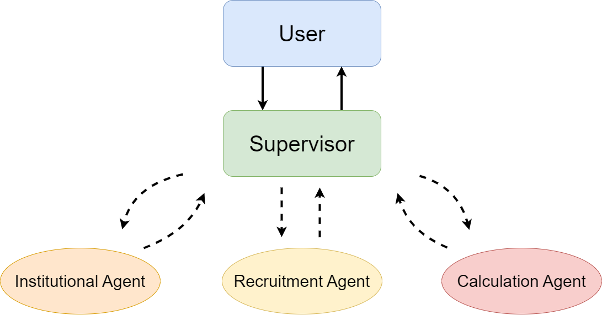

# HR Specialist Multi-Agent System
Welcome to the HR Specialist Multi-Agent System! This application is designed 
to streamline various HR-related tasks using specialized agents.

System presentation: https://youtu.be/dMbQ4icxXxc

Also refer to *presentation.pdf* for details.

## Overview

The HR Specialist Multi-Agent System employs a combination of LangChain and 
LangGraph technologies to manage HR tasks through multiple specialized agents 
and a central supervisor. Streamlit is used to provide an interactive web 
interface.

### Institutional Agent

The Institutional Agent handles queries related to company policies, benefits, 
and institutional guidelines. It uses a document retrieval system that 
incorporates FAISS for vector-based search. Documents are split into chunks 
using RecursiveCharacterTextSplitter, indexed, and then combined with a text 
generation model through create_retrieval_chain. This setup allows the agent 
to provide detailed responses based on the retrieved information.

### Recruitment Agent

The Recruitment Agent manages candidate selection, including screening 
applications and assessing qualifications. It uses create_react_agent to set 
up a graph that works with a chat model capable of tool calling. This agent 
interacts with a language model and utilizes tools to process application data.
The SummarizeCVs tool is used to automate the retrieval and summarization of 
curriculum vitae (CVs) from a specified directory, generating summaries that 
highlight key qualifications and experiences.
 
### Calculation Agent

The Calculation Agent performs time tracking calculations, such as computing 
total working hours. It also uses create_react_agent to create a graph that 
integrates with a chat model for tool calling. The WorkingHoursCalculator tool 
is employed to compute working hours based on clock punches, calculating the 
total minutes between pairs of punches and converting this into hours and 
minutes. Additionally, the CalculatorTool handles mathematical calculations 
using LLMMathChain, processing arithmetic or complex queries to provide 
accurate results.

### Supervisor Agent

The Supervisor Agent manages and coordinates the various specialized agents 
within the system. It ensures smooth workflow by overseeing task delegation 
and monitoring agent activities. The Supervisor Agent utilizes a chain that 
integrates a model and a prompt to handle agent outputs and decisions, 
ensuring accurate task management.

The system is configured with a StateGraph that directs the interactions 
between agents. This setup allows the Supervisor Agent to determine which 
agent should handle specific tasks based on current states and outputs. It 
ensures that the Institutional, Recruitment, and Calculation Agents perform 
their functions effectively, with tasks routed and completed as needed.

## Repository Structure

- **app.py**: The main entry point for the application. This script 
initializes the multi-agent system, sets up the Streamlit interface, and 
starts the application, enabling user interaction through a web interface. 
It also manages the LLMs utilized, the tools assigned to each agent, and the 
prompts that guide agent behavior.

- **agents.py**: Defines the specialized agents used within the system. It 
contains the logic for creating and managing these agents.

- **tools.py**: Contains the definitions of tools that agents use to perform 
specific tasks. These tools are essential for the agents to process and act on 
the data.

- **prompts.py**: Includes the prompts used by the agents to interact with 
the LLMs. It provides predefined instructions and templates that guide agent 
behavior during task execution.

- **cvs_docs/**: Holds curriculum vitae (CV) files used by the Recruitment 
Agent for screening and summarization.

- **institutional_docs/**: Contains institutional documents, such as company 
policies and onboarding manuals, used by the Institutional Agent.

- **requirements.txt**: Lists all the Python dependencies required for the 
project.

- **.env.example**: A template of the `.env` file, providing a reference for 
necessary environment variables. It is useful for setting up the development 
environment by copying and renaming it to `.env`.

## Setup

To set up the HR Specialist Multi-Agent System locally, follow these steps:

1. Make sure you have Python 3.10
2. Clone the repository
3. Create a virtual environment
4. Install the dependencies in requirements.txt
5. Configure the environment variables
   - Copy the .env.example file and rename it to .env.
   - Fill in with OpenAPI and LangSmith API keys.

6. Start the application with ``streamlit run app.py``

This will start the Streamlit server, and you can access the application 
interface through your browser at http://localhost:8501.